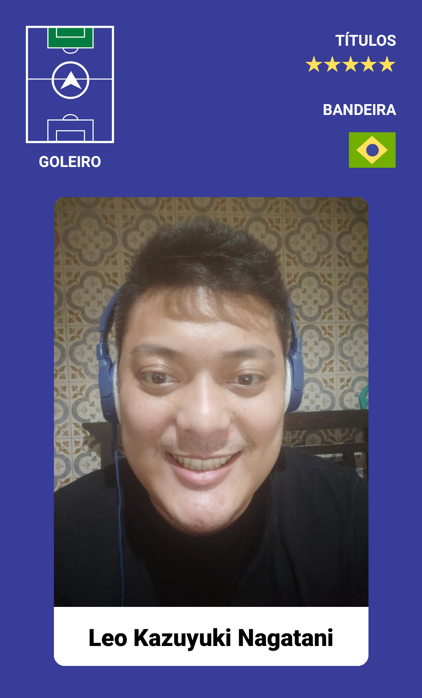

[Roadmap](#roadmap) |
[Documentação](#documentação) |
[Como Executar](#rodando-localmente) |
[Projeto](#stack-utilizada) |
[Next Level](#melhorias) 




# NLW Copa - Crie sua figurinha personalizada - Mobile React Native

- Nome do Evento: NLW Copa
- Data: De 31/10 a 04/11 de 2022
- Empresa: Rocketseat
- Aula ministrada por: Rodrigo Gonçalves Santana(Educator na Rocketseat)
- Conteúdo: Construção de uma aplicação para criar sua figurinha personalizada com foco no uso das seguintes features(Utilizar câmera do dispositivo, obter screenshots, compartilhar imagem)

## Roadmap

- Git clone do repositório
- Instalação da aplicação
- Instalação do expo camera
- Inicialização da camera do usuário
- Instalação do react-native-view-shot
- Instalação do expo sharing

## Stack utilizada
React Native, StyleSheet, Expo

## Rodando localmente

Clone o projeto

```bash
  git clone https://github.com/leokazuyukinagatani/mysticker
```

Entre no diretório do projeto

```bash
  cd mysticker
```

Instale as dependências

```bash
  npm install
```

Inicie o servidor

```bash
  expo start
```


## Melhorias

Que melhorias você fez no seu código? Ex: refatorações, melhorias de performance, acessibilidade, etc


## Aprendizados

O que você aprendeu construindo esse projeto? Quais desafios você enfrentou e como você superou-os?

- Utilizar React Native
- Utilizar Câmera do dispositivo
- Tirar screenshots
- Compartilhar imagens


## Suporte

Para suporte, mande um email para [leokazuyukinagatani@gmail.com](mailto:leokazuyukinagatani@gmail.com?subject=nlw-esports-mobile)


## Relacionados

Segue alguns projetos relacionados

[Awesome README](https://github.com/matiassingers/awesome-readme)